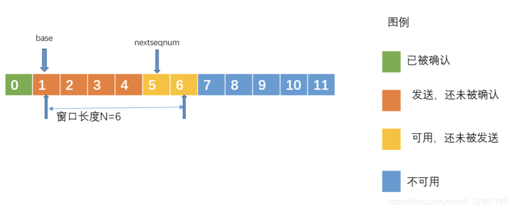
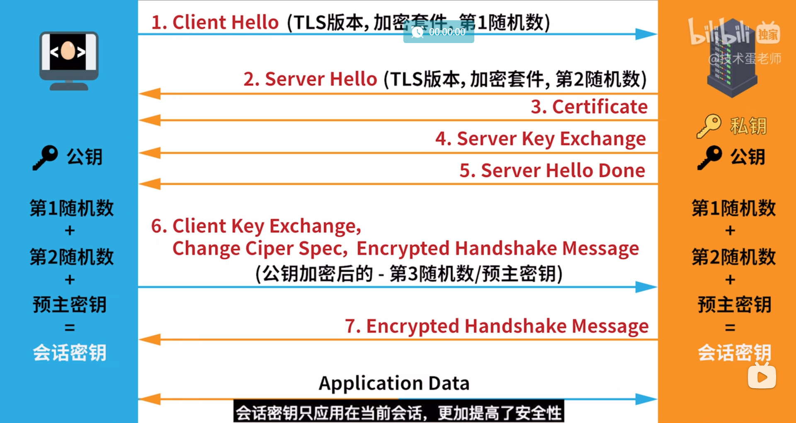

# 计网重要的面试题
面试题，全部在这里，懒得分别整理了。
# 五层协议
## 物理层
在物理阶段, 现实意义的连接两台机器. 比如电缆线或者什么的, 传输物理意义上的信号.

## 数据链路层
如果只有物理层那肯定是什么也做不好的. ~~好比什么都不给让你写一篇英语作文~~. 好比你什么都不知道就要你造一辆汽车出来；因此我们需要制定一些规则, 来使得这些**信息的组织变得有规律**. 
这个规律, 就是现在的**以太网协议**

> 以太网协议: 以太网协议规定，一组电信号构成一个数据包，我们把这个数据包称之为帧。每一个桢由标头(Head)和数据(Data)两部分组成。
> Head （Meta data）, Data里面自然就是对应的数据了. 区分头和data的方式是**固定头的大小, 固定为18个字节.**

并且, 不同的网络设备之间**需要一个可以用来区分彼此身份的地址(Addr)**, 这个地址就是 MAC地址（注意与IP地址区别，这个通常也被称为物理地址.

> 连入网络的每一个计算机都会有**网卡接口**，每一个网卡都会有一个唯一的地址，这个地址就叫做 MAC 地址。计算机之间的数据传送，就是通过 MAC 地址来唯一寻找、传送的。
MAC地址 由 48 个二进制位所构成，在网卡生产时就被唯一标识了. (不过肯定是可以修改的, 在数据的层面.)

## 网络层
**广播和ARP地址**
光是知道地址也无法直接传送信息, 比如我告诉你我住在英国伦敦的贝克街213号. 然后你就准备给我送快递了吗? 肯定不行. 
计算机同理. 计算机 A 不仅连着计算机 B，而且计算机 A 也还连着其他的计算机。 虽然计算机 A 知道计算机 B 的 MAC 地址，可是计算机 A 却**不知道计算机 B 是分布在哪边路线上**，为了解决这个问题，于是，有了广播的出现。

不过广播这个词语本身并不是这个意思. 所以联想一下, 这个词语可以意味着广播实际上是一个**解决方案**: 向线路里面的设备发送包含指定 MAC地址的数据报. 这个过程就像是:

> 这种发送方式我们称之为广播,就像我们平时在广场上通过广播的形式呼叫某个人一样，如果这个名字是你，你就理会一下，如果不是你，你就当作听不见。

那ARP协议又是什么呢? 只讨论它的存在意义的话, 很简单啊! 计算机 A 是如何知道计算机 B 的 MAC 地址的呢？ 就是通过这个 ARP 协议. 
+ [x] ~~2022-08-14 12:18~~ ARP协议原理
ARP协议的运作依赖 IP地址. 
> ARP协议也是通过广播的形式给同一个子网中的每台电脑发送一个数据包(当然，这个数据包会包含接收方的IP地址)。对方收到这个数据包之后，会取出IP地址与自身的对比，如果相同，则把自己的MAC地址回复给对方，否则就丢弃这个数据包。这样，计算机A就能知道计算机B的MAC地址了。

**哈哈要我说的话这个过程就像是在一个数组里面找到一个唯一的值一样，那可不是就需要每一个都遍历一遍了嘛！**

我的理解是, 这个arp协议**只有在不知道对应机器的 MAC地址 的时候**用上面这种方式获得 设备的 MAC地址. 
不过这样一来, 我的疑问就来了, 传输数据用的是广播, 然后比对 IP地址. ARP协议获取 IP地址也是用这种方式, 那么 **mac地址本身好像从来没有用到过似的**...
现在的问题就是： 这个mac地址和IP地址，在网络层这一层，他们的具体的区别：
我不知道
> 可能有人会问，知道了MAC地址之后，发送数据是通过广播的形式发送，询问对方的MAC地址也是通过广播的形式来发送，那其他计算机怎么知道你是要传送数据还是要询问MAC地址呢？其实在询问MAC地址的数据包中，在对方的MAC地址这一栏中，填的是一个特殊的MAC地址，其他计算机看到这个特殊的MAC地址之后，就能知道广播想干嘛了。

**DNS**
DNS的概念因为做过 Linux的考试, 所以这个东西本身是干什么的我很清楚. 具体原理的话这里也没解释, 所有就写成这个程度.

**子网的概念**
刚刚上面里面提到了广播, 那么就不得不提到子网了. 
还是用广播做联想, 在学校里面播放的广播, 你在家里面的妈妈可以听到吗? 理论上播放广播的人是只想让你听到的对吧. 
那么在计算机网络里面, 我们保证, 发送数据的时候, 只在一个子网里面广播, 如果需要传输到子网外面, 那么就需要网关. 比如你麻麻如果要听到学校广播, 她可以用一台收音机.

由这个地方引出 IP地址.


**IP地址**
暂时只讨论 IPv4.
这个 IP 地址由 32 位的二进制数组成，我们一般把它分成4段的十进制表示，地址范围为0.0.0.0~255.255.255.255。
如果要讨论IPv6的话；
这个 IP 地址由 128 位的二进制数组成...不过国内6没有普及，我也暂时没有找到好的资料。


每一个联网的机器都会有 IP地址, 分为网络地址 和 主机的地址, 前者就是子网的地址, 后面就是网络的地址. 通过**子网掩码** 可以知道 IP地址的网络地址和主机地址对应都是多少位.

IPv4的环回地址是127.0.0.1，不过到127.255.255.255之间的地址都是保留的；
而6代不同于4，表示为:::1（未确认），而且只有一个环回地址，不像4还有保留；

**因此，网络层的功能就是让我们在茫茫人海中，能够找到另一台计算机在哪里，是否属于同一个子网等。**

## 传输层
**传输层是计网的重点.** 众所周知的 TCP, UDP 协议都在这一层.
前三层, 帮助我们实现信息跨计算机的传输了. 传输层就是计算机内部层面的网络协议了. 

只说大概, 也很简单, 使用 端口(Port). 端口好比设备内部的 IP地址.

这个总结的很好: 
**也就是说，传输层的功能就是建立端口到端口的通信。相比网络层的功能是建立主机到主机的通信。**

## 应用层
最接近用户的一层, 这里基本已经是交给程序处理的部分了. 这里的就是 HTTP 协议什么的.


# 通信双方保证信息不丢失
由**数据链路层**的结论可知, 数据的传输是分成一个个小的分组传送的.
导致数据不正确的可能有两个原因: 

1. 这个分组在传输的过程中，由于在信道传输过程中，受到干扰，导致这个分组到达目的地之后**出现了差错**，例如分组里面的二进制位1变成了0，0变成了1。
2. 分组还没传输到目的地，就丢失了，我们也把这种情况称之为丢包。

> 第一个的话好像是有一个校验的机制, 然后解决的方式也简单粗暴, 发送方直接重传. 

> 第二个也是重新传送, 不过这次又引出了一个效率的问题, 使用**流水线解决**

确保这个流水线正常运作的就是所谓的 **滑动窗口协议**.

## 回退N步协议(GBN) 滑动窗口协议
在回退N步法中允许发送多个分组而不需要等待确认，但它也受限于在流水线中未确认的分组数不能超过某个最大允许数N。如下图，我们将基序号定义为最早的未确认分组的序号，将下一个序号(nextseqnum)定义为最小的未使用序号(即下一个待发送分组)。

我说说我自己的理解.


绿色, 已经被双方认可都发送成功的数据. 
橙色, A觉得我发了, 但是 B还没有回复我到底有没有发送成功. 
黄色, A在橙色变成绿色之后, 就准备开始发送的内容. 
蓝色, A觉得还没轮到你们. 

发送方(下文用A表示) 在这个协议里面需要处理两个事件: 
1. A 收到的 ACK代表序号n 以及n前面的内容已经成功交付. 
1. 如果超时(没有接收到B发来的 ACK信号), A会重新发送橙色的内容.

接收方(下文用B表示) 在这个协议里面需要处理一个事件: 
如果一个序号为n的分组被正确收到，并且按序(所谓按序就是指n-1的分组也已经收到了)，则B为分组n发送一个ACK，否则，丢弃该分组，并且为最近按序接收的分组重新发送ACK。
接收方的这种处理方式，意味着如果n被正确交付，则意味着比n小的所有分组也被正确交付了。

这种方式有一个显而易见的缺点, 就是他的效率并没有提高多少, 和前面的重新发送是差不多的.
> 回退N步协议的缺点也是很明显的，单个分组的差错能够引起GBN重传大量的分组，而且许多分组根本就没有必要重传。例如我们发送的序号为0-100，万一序号为1的分组出现了某些差错，这会导致1-100的分组会被重传，想想这是多么恐怖的事情啊。

是的这句话的意思很简单, 如果因为这一个导致100个要重新弄, 这也太蠢了, 明显有可以优化的空间. 


**选择重传**

我片面的理解: 知道滑动窗口里面对应的数据全部都变成绿色了再考虑移动窗口的事情.

窗口的大小 N 由**拥塞控制** 决定.

# 简述 集线器、交换机与路由器有什么区别？
先说说最简单的连接吧. 
每个电脑都一个网线口, 可以连接网线. 这就是之前说到的直接的物理连接.

可是, 如果数量一个, 口子却只有一个, 那么这种方式就不行. 于是就使用一个中介, 他有多个网线口, 可以负责连接各个设备.
这个东西就是 **集线器**. 他在物理层.

不过机器一多, 就有精准发送信息的需求了. 

那么根据地址负责**精准传输**的设备就是**交换机**. 他在数据链路层.

那么如果人越来越多, 以致于一些没有网线的人也想来加入连接了, 彼此之间的信息交流都不一样, 那这是怎么办呢?

那这个措施就是统一语言: 比如统一成英语. 

> 那如何实现呢？小伙伴们规定，不同的村子间先在各自的操作系统上加上一套相同的协议。不同村落通信时，信息经协议加工成统一形式，再经由一个特殊的设备传送出去。这个设备就叫做路由器。路由器通过IP地址寻址，我们说它工作在计算机的网络层。

路由器就是做这个工作的, 他实现跨区域互联, 位置在分层的**网络层**.

总结: **交换机适合局域网内互联，路由器实现全网段互联。**

# 【番外篇】Sakura FRP 介绍的内网穿透的知识
整篇我都看完了, 没有太过于难以理解的知识: 
Sakara FRP 提供 公网ip
电脑A和电脑B的连接大概是这样一个过程: 
A电脑 地址:端口 ←→ FRP提供隧道: 代理地址:端口 ←→ B电脑 地址:端口
# 什么是 TCP 拥塞控制？
> 大家可能都听说过拥塞控制和流量控制，想必也有一些人可能还分不清拥塞控制和流量控制，进而把他们当作一回事。拥塞控制和流量控制虽然采取的动作很相似，但拥塞控制与网络的拥堵情况相关联，而流量控制与接收方的缓存状态相关联。

也就是说，拥塞控制和流量控制是**针对完全不同的问题而采取的措施**.
+ [ ] 似乎是不同问题，但是采用的是类似的解决思路；

## 拥塞控制有什么作用
一般来说，两台主机在传输数据包的时候，如果发送方迟迟没有收到接收方反馈的 ACK，那么发送方就会认为它发送的数据包**丢失了**，进而会重新传输这个丢失的数据包。

然而事情情况是, 是因为**本来路就堵**. 

以送快递做例子, A 给B寄了一个东西, 要求B收到之后发一个回复消息给A. 但是因为堵车, 这个东西B一直没有收到, 那么A**错误的以为东西已经丢了, 而实际上东西还在路上**, 导致路变得**更加拥挤.**

这种情况毫无疑问需要避免. 引入拥塞控制:
**换句话说，对于数据报丢失的判断，还要考虑线路拥堵的情况；**

## 拥塞控制流程
想象一下：在这么一种情况下：
AB之间已经建立好连接，但是A现在**不知道现在网络是不是真的拥堵**；所以就发送数据报来试探，如果这些数据报都可以正常发送的话，下一次就增加发送的数据报的量；

ssthresh: 阈值
所以**最终的策略**是：前期指数增长，到达阈值之后，就以一个一个线性的速度来增长。

最终肯定会瓶颈，总不可能无限增长吧。当出现超时事件时，我们就认为此时网络出现了拥塞了，不能再继续增长了。我们就把这个时候的N的值称之为瓶颈值吧，用MAX 这个变量代替.

新的 ssthresh = MAX / 2

不过, 前面也说了, 导致A迟迟没有收到 ACK 确认信号的原因不只因为网络, 别忘了一开始提到的**数据报本身可能已经丢失或者损坏**.

需要一种机制来帮助**判断到底是哪一种情况：**.

这个机制就是: 冗余 ACK

这个过程其实可以用**发送邮件**的方式来类比：
> 如果某个数据报N丢失, B会连续重传 ACK(N - 1) （我一开始想说如果b可以传递回来的话那线路不卡啊，但是后来一想如果是信道的话那就不一样了）, 如果此时定时器（过了这个定时器判断要么拥堵要么数据报孙欢）没有超时, 并且A收到了三个以上的 ACK, 那个就可以判断 数据报N已经丢失或者损坏, 这个时候A就不必等待N设置的计时器到期了，而是快速重传N。并且把ssthresh设置为MAX的一半，即ssthresh = MAX/2，但是这个时候并非把控制窗口N设置为1，而是让N = ssthresh，N再一个一个增长。


所以总结一下重要的: 
- 如果判断是网络拥堵, 那么滑动窗口的大小设置为1
- 若是丢失, 不是拥堵（未超时的情况下连续收到对方发送的三个ACK）, 那么就把滑动窗口的大小设置为阈值 ssthresh, 提高效率. 并且拥有这种机制的 TCP 协议称作: TCP Reno

还有另外一种TCP版本，无论是收到三个相同的ACK还是发生超时事件，都把拥塞窗口的大小设为1，从最初状态开始，这种版本的TCP我们称之为TCP Tahoe。

所谓窗口就是到底怎么怎么发送数据的问题；

# 什么是 TCP 流量控制（）
原理和拥塞控制其实差不多（都是用的滑动窗口）, 只不过解决的问题不同. 

## 需要进行流量控制的原因
因为双方的速率可能不对等. 那么此时相对双方而言**等效的速率就会是速度慢的那一边**. 对于快的那一边来说, 这就会**浪费大量的资源**. 所以你需要**维持双方速率的动态平衡**.

## 实现
接收方每次收到数据包，可以在发送确定报文(ACK)的时候，同时告诉发送方自己的缓存区还剩余多少是空闲的（应该把数组封装到ack里面就可以了），我们也把**缓存区的剩余大小**称之为接收窗口大小，用变量 win 来表示接收窗口的大小。

不过这个可以存储 接受窗口的信息的报文是**有可能丢失**的, 此时双方可能就可能进入"死锁".

类似的, 可以使用"定时器策略": 

> 当接收方的 win的大小为0, 发送方停止发送的时候, 接收方可以考虑**设置定时器**以及**发送试探信号**.

## 一些注意事项
> 这里说明下，由于TCP/IP支持全双工传输，因此通信的双方都拥有**两个滑动窗口**，一个用于接受数据，称之为接收窗口；一个用于发送数据，称之为拥塞窗口(即发送窗口)。指出接受窗口大小的通知我们称之为窗口通告。

说人话就是双方都可以是发送者和接受者, 所以两边两个窗口都有.

> 现在的滑动窗口的大小是根据算法动态调整的.

滑动窗口的大小要适中, **太小浪费连接资源**, 太大则**没有必要并且浪费内存**.

# TCP三次握手(最频繁的面试题)
**简易的三次握手的过程:**
1. 第一次握手：客户端给服务器发送一个 SYN 报文。

2. 第二次握手：服务器收到 SYN 报文之后，会应答一个 SYN+ACK 报文。

3. 第三次握手：客户端收到 SYN+ACK 报文之后，会回应一个 ACK 报文。

4. 服务器收到 ACK 报文之后，三次握手建立完成。

我记得hsp将Java的网络的部分的时候也是说了这个的.

> 拨号的人: 你听到了吗?
> 收听的人: 我听到了, 你收到信就发个消息过来.
> 拨号的人: 好, 那我就开始发消息了.
> 拨号的人开始说话.

## 为什么要进行三次握手(通俗的版本)
三次握手的过程中确认的信息: 两端的发送用out表示, 接受用in表示, 最终情况是需要**双端的 in和out都正常**才能开始发送.
第一次握手: 服务器得出结论: 客户端的 out正常, 服务器的in正常;
第二次握手: 客户端得出结论: 服务器的 out正常, 客户端的in正常; 并且有这个消息可以得出第一次服务器握手时候的结论, 此时客户端已经可以确认双端都正常;
第三次握手: 服务器得出结论: 客户端的in正常, 服务器的out正常;

这个时候双方**都可以确认彼此之间可以正常发送消息了**, 所以开始发送消息.

但是...
因为三次握手的过程中，双方是有很多状态的改变的，而这些状态，也是面试官可能会问的点。

## 加分描述(背这个) 如果要描述这个的话，这个很重要，算是标准答案
需要记几个 专有的名词:
刚开始**客户端处于 closed 的状态，服务端处于 listen 状态**。
1. 第一次握手：客户端给服务端**发一个 SYN 报文**，并指明客户端的**初始化序列号** SN(c)。此时客户端**处于 SYN_Send 状态**。
    1. 第一次握手做三件事: 发送报文; 告知初始化的序列号SN(c); 进入 SYN_Send状态, 我理解的是**待发送**状态.;
1. 第二次握手, 服务器也会初始化自己的序列号ISN(s), (信息在SYN里面), 并且为了反馈**已经收到了来自客户端的信息**, ACK(Acknowledge)的值会设置为 客户端的 SYN的值加一. 此时服务器处于 SYN_REVD 的状态。
    1. 第二次握手: 服务器也初始化自己的序列 SYN, 并且设置 ACK 就是 客户端 SYN+1, 进入**待接收** 的状态。
1. 第三次握手: 也是一样把服务器的 ISN + 1 作为 ACK 的值，表示已经收到了服务端的 SYN 报文，此时客户端处于 establised 状态。
1. 最后就是服务器收到了, 双方建立连接. 

我个人觉得，这里可以按照**角色、行为、状态、以及意义**这样子来背。
东西不复杂，就是需要一些时间来理清楚这个过程。

## 其他作用以及一些注意的点
- 确认双方的接受能力、发送能力是否正常。
- 指定自己的初始化序列号，为后面的可靠传送做准备。

ISN(Initial Sequence Number)**不是固定的**, 双方用这个数据告知对方接收数据的时候, 如何按序列号组装数据.
七牛云二面的面经中提到这个值应该叫seq。

如果ISN是固定的，**攻击者很容易猜出后续的确认号**，因此 ISN 是**动态生成**的。

**关于RST**字段
意思是重置的标志位（ACK也在这个级别），当建立连接或者释放资源的时候，如果出现异常，rst这个就会起作用。
它的主要作用是释放资源，防止未建立成功的连接一直占用系统资源。


**报文头部携带的数据的信息** 

TCP首部占**32位字节**，其中有序列号seq，确认号ack以及标志位SYN，ACK，FIN等。 **一部分是值，一部分是状态码**这个seq就是对应的序列号，然后ack的值往往就是对方的seq然后加上1.
当标志位ACK = 1时，确认号ack的值才有效。
三次握手标志位与序列号、确认号的变化是：
SYN = 1, seq = ISN(c)
SYN = 1, ACK = 1, seq = ISN(s), ack = ISN(c) + 1
ACK = 1, seq = ISN(c) + 1, ack = ISN(s) + 1

# TCP的四次挥手
这个四次挥手就是**通信的双方结束连接的时候需要的步骤.**
首先因为有了之前三次握手的原因, 你**可能以为**TCP关闭连接的时候也是类似的三次. 其实不是的. 我用我自己的语言来解释一遍: 
TCP 是**双边通信**: 意味着连接建立后 双方都既可以是发送者和接受者. 不过**建立连接的时候**, 只要由一边发起请求就可以了. 

但是! 断开连接的时候, 由于双方**都有发送和接收**的功能, 所以需要关闭双方的发送和接收的功能. 这个**需要四次握手**的过程完成. 

## 过程
刚开始双方都处于 establised(意思是已建立连接) 状态，假如是客户端先发起关闭请求，则：
1. 第一次挥手: 客户端发送一个 FIN 报文，报文中会指定一个序列号。此时客户端处于FIN_WAIT1状态。 我个人的理解是, C 向 S发送信号, 我要停止发送了;
1. 第二次挥手: 服务端收到 FIN 之后，会发送 ACK(确认) 报文，且把客户端的序列号值 + 1 作为 ACK 报文的序列号值，表明**已经收到客户端的报文**了，此时服务端处于 CLOSE_WAIT状态。 我个人的理解是: S收到了C的信息, 并且表示自己知道你要关了, 发送这个回复信息.
1. 第三次挥手: (此时C的发送已经停止, S的接受功能已经停止) 服务器也想关闭连接, 那么他就要**重复类似第一次挥手**时候的过程: 发给 FIN 报文，且指定一个序列号。此时服务端处于 LAST_ACK 的状态;
1. 第四次挥手: 客户端接收到报文, 也发送一个 ACK 报文作为应答，且把服务端的序列号值 + 1 作为自己 ACK 报文的序列号值，此时**客户端处于 TIME_WAIT 状态**(这个又叫做**延迟关闭**)。需要过一阵子以确保服务端收到自己的 ACK 报文之后才会进入 CLOSED 状态, 这是为了**防止出现服务器没有接收到自己的 ACK报文而自己提前关闭导致服务器阻塞的情况**. 
1. 最后, 服务器接收到了来自客户端的请求, 此时服务器关闭自己的连接, 处于 closed的状态.

重点就是为什么第四次挥手的时候需要设置一个延迟关闭的问题: 
> 就是要理解，为什么客户端发送 ACK 之后不直接关闭，而是要等一阵子才关闭。这其中的原因就是，要确保服务器是否已经收到了我们的 ACK 报文，如果没有收到的话，服务器会重新发 FIN 报文给客户端，客户端再次收到 ACK 报文之后，就知道之前的 ACK 报文丢失了，然后再次发送 ACK 报文。

状态的含义: 我感觉理解含义就可以，不用可以去记忆。
  LISTEN – 侦听来自远方TCP端口的连接请求；
  SYN-SENT -在发送连接请求后等待匹配的连接请求；
  SYN-RECEIVED – 在收到和发送一个连接请求后等待对连接请求的确认； 
  ESTABLISHED- 代表一个打开的连接，数据可以传送给用户； 
  FIN-WAIT-1 – 等待远程TCP的连接中断请求，或先前的连接中断请求的确认； 
  FIN-WAIT-2 – 从远程TCP等待连接中断请求； 
  CLOSE-WAIT – 等待从本地用户发来的连接中断请求； 
  CLOSING -等待远程TCP对连接中断的确认； 
  LAST-ACK – 等待原来发向远程TCP的连接中断请求的确认； 
  TIME-WAIT -等待足够的时间以确保远程TCP接收到连接中断请求的确认； 
  CLOSED – 没有任何连接状态；


# 超时重传
来自[知乎专栏](https://zhuanlan.zhihu.com/p/101702312)
暂时不看。东西有点多。


# HTTP
首先它肯定也是协议。“HTTP 是基于 TCP/IP 协议的应用层协议。”但是这个协议不涉及具体的数据包（packet）的传输。主要规定了客户端和服务器之间的**通信格式**（个人认为相当于Java的流，表示数据的格式），默认使用80端口。

0.9版本是最早发布的。 不考虑。
HTTP/1.0
相比原本的贫瘠的内容，增加了大量的新特性：
1. 可以传输任何内容，不仅仅是字符串；
1. 除了GET命令，还引入了POST命令和HEAD命令
1. HTTP请求和回应的格式也变了。除了数据部分，每次通信都必须包括头信息（HTTP header），用来描述一些元数据。
1. 还有多种其他内容，包括状态码（status code）、多字符集支持、多部分发送（multi-part type）、权限（authorization）、缓存（cache）、内容编码（content encoding）等。

示例：
请求：
```yml
GET / HTTP/1.0
User-Agent: Mozilla/5.0 (Macintosh; Intel Mac OS X 10_10_5)
Accept: */*
```
第一行是请求命令，必须在尾部添加协议版本（HTTP/1.0）。后面就是多行头信息，描述客户端的情况。

```yml
'HTTP/1.0 200 OK
Content-Type: text/plain
Content-Length: 137582
Expires: Thu, 05 Dec 1997 16:00:00 GMT
Last-Modified: Wed, 5 August 1996 15:55:28 GMT
Server: Apache 0.84

<html>
  <body>
  Hello World
  </body>
  </html>
```
回应的格式是”头信息 + 一个空行（\r\n） + 数据”。其中，第一行是”协议版本 + 状态码（status code） + 状态描述”。

如果你用dev tool的network工具查看的话，它会给你区分开来。

在上面的这个响应中有一个重要的字段： Content-Type 字段

它的编码必须是ASCII码，它的值表示后面其他的信息是什么格式的，就是告诉别人应该怎么解析。

这些数据类型总称为MIME type，每个值包括一级类型和二级类型，之间用斜杠分隔。
MIME type还可以在尾部使用分号，添加参数。

客户端请求的时候，可以使用Accept字段声明自己可以接受哪些数据格式。

1.0版本一个最主要的缺点就是： 一次连接里面只进行一次传输。
由于新建tcp连接的成本很高，所以1.0的性能很差。

1.1版本
引入了持久连接（persistent connection），也就是说tcp连接不关闭，可以被多个连接复用。

默认cs之间如果一段时间内没有交互的时候就断开连接。
不过标准是客户端在最后一个请求时，发送Connection: close，明确要求服务器关闭TCP连接。 这个应该不重要。

并且引入了“管道机制”，就是一次连接内可以发送多个请求；

Content-Length字段：
在多个请求连在一起，那就肯定有一种机制是用来区分数据包的； 这个就是制定数据包的长度的；

分块传输编码
在进行耗时操作的时候，我们希望这个操作转换到后台，此时Content-Length字段这个字段提供的意义就不大了； 所以当分批次传输数据的时候，由每个分块携带一个长度信息
（换句话说由进来的消息自己通知接收端自己已经发送完毕了，有点回调的那个意思；）

1.1的主要缺点就是“单线程”的处理机制。 这个就是差不多的事情了。

**在浏览器输入URL回车之后发生了什么？**

我看了技术蛋老师的视频：他这里使用去医院看病做的比喻：
dns解析相当于去医院挂号，然后你才能知道对应的状态要去哪个科室；
进入医生的办公室之前，需要先敲门，然后医生要回应你，这个过程就相当于三次握手。
见到医生后，你需要阐述你的病情，这个就相当于http的请求；

流程的话： 首先需要把url转换成ip地址 -> dns协议；
获取到ip地址后，需要与服务器建立稳定的连接 -> tcp协议；
并且在这之中，需要先获取到服务器具体的物理地址 -> arp协议与广播
定位到地址后，数据包在路由里传输的时候涉及到最短路径协议（ospf），本质是迪杰斯特拉算法；

然后就是http协议。 这个过程不是很难。 后面就是浏览器接收到服务端数据，开始渲染页面给用户看，这一次过程就相当于结束了。


## HTTP常见的状态码
101 切换请求协议，从 HTTP 切换到 WebSocket
200 请求成功，有响应体
301 永久重定向：会缓存：下次访问同一个地址会直接跳转到重定向的地址；
302 临时重定向：不会缓存：再请求一次服务器看重定向的地址在哪里
304 协商缓存命中
403 服务器禁止访问 403 forbiddon
404 资源未找到：not found
400 请求错误：bad request
500 服务器端错误：
503 服务器繁忙
502 上游网关错误，其实我也不知道

## get和post的区别
[来源](https://www.iamshuaidi.com/683.html)
**使用场景**：
我的理解是： GET和POST都是字面意思： get用于从服务器获取资源，**不会改变服务器的状态**；post用于传输实体给服务器，就是所谓的上传，有可能改变服务器的状态；

**携带参数**
GET 和 POST 的请求都能使用额外的参数，但是 GET 的参数是以查询字符串出现在 URL 中，而 POST 的参数存储在实体主体中。
post的信息并非因为存在在实体中而显得安全，非s的协议也是明文的，照样可以被查看。
因为url上只支持ASCII编码，所以对于非英文的字符有对应的编码规则：一般是三个字节。

**服务器安全性**
前面说了，因为get是安全的，post是不安全的。

拓展：
安全的方法除了 GET 之外还有：HEAD、OPTIONS。
不安全的方法除了 POST 之外还有 PUT、DELETE。

**缓存机制**
就是浏览器对服务器发起请求时，某些重复的请求可以不用再次访问服务器，以此节省服务器的资源：
> 请求报文的 HTTP 方法本身是可缓存的，包括 GET 和 HEAD，但是 PUT 和 DELETE 不可缓存，POST 在多数情况下不可缓存的。
响应报文的状态码是可缓存的，包括：200, 203, 204, 206, 300, 301, 404, 405, 410, 414, and 501。
响应报文的 Cache-Control 首部字段没有指定不进行缓存。

**还有一部分关于XMLHttpRequest的追加内容**：
首先这个东西是前端，可以异步的发送请求，更新数据，而不刷新页面；
然后是在这个api里面，post和get区别在于header和data是否会分开发送；

## HTTPS介绍
**我是看了别人的面经，问https的加密过程所以来看的**。
当问这个的时候，可能是问非对称加密的过程；也有可能是具体整个https的TLS的握手过程，我大概都有一遍印象了。

整个http的过程**完全明文**，所以在不想第第三方知道通信内容的情况下，诞生了HTTPS（secure）的需求；他依赖于tsl/ssl协议；

首先了解加密的发展过程： 对称加密 -> 非对称加密；
对称加密最明显的缺点就是因为通信机制端原因这个加密措施容易被破解。

非对称的特点就是用多对密钥来进行加解密。

证书这里我没怎么听懂：
需求： 有坏东西伪造成你要访问的地址来破坏你的信息；
所以有**第三方的、权威的**机构向官方的域名办法证书；你的浏览器会判断有证书才真的进行访问；最广为人知的是ssl证书。 并且证书里面还**包含了非对称加密用到的公钥和私钥**；简单地说，安装ssl证书之后的服务器，可以通过https协议来访问。

**访问一个HTTPS服务器的过程**
其实就是在三次握手建立后验证证书的一个过程（也就是说是属于HTTPS的一个特有的过程）
首先客户端要先跟服务端打招呼：Client Hello；然后展示自己的TLS的版本以及支持的加密算法的类型；然后还要发送一个随机数；
然后服务端接收到消息之后，打招呼：Server Hello，然后展示自己的TLS的版本以及告知选择的加密套件。同时也会发送一个随机数给对方。

之后服务端会再返回一个响应：里面包含证书的信息；
然后下一步server key exchange会发送公钥的消息。
由于服务器回复了大量的相应，所以最后服务器会发送一个 Server Hello Done表示服务器这里暂时完事，需要客户端来处理了；
客户端接收到上面的东西后，浏览器会通过算法验证证书是否可信。
...

可以用一个非常清晰的图片：



## Cookie和Session的区别
HTTP是**无状态的协议**。 也就是原先一开始，即便是同一个客户端，服务端在第二次接收到客户端的请求的时候，对这个客户端也是一无所知的。 这种当然局限性很大；所以引入了**一种记录客户端状态的机制**。 以购物车为场景： 
当你点击下单按钮时，由于HTTP协议无状态，所以并不知道是哪个用户操作的，所以服务端**要为特定的用户创建了特定的Session**，用于标识这个用户，并且跟踪用户，这样才知道购物车里面有几本书。
所以session的本质就是用来给服务端进行识别的一个数据。因此保存这个数据的方法有很多，我觉得就像其他数据一样，是sql和redis之类的缓存结合在一起使用的。

在一些大型的项目中， 还会涉及到集群的问题；
回顾**集群的概念**：
集群就是当一台物理服务器已经不足以满足需求，需要多台服务器的时候， 机器的使用策略变成多台机器提供服务。
集群的时候也要考虑Session的转移，在大型的网站，一般会有专门的Session服务器集群，用来保存用户会话，这个时候 Session 信息都是放在内存的，使用一些**缓存服务**比如Memcached之类的来放Session。

对应的，客户端也需要有相应的信息来帮助服务器确认客户：
这个技术就是cookie，伴随客户端每次发送请求的时候附加一个cookie信息过去。在服务端第一次创建session的时候，也会在Response中附加sessionId信息让cookie记录。
下次如果再发送请求的时候就可以根据cookie的信息查找到对应的消息；

此外，cookie即使被禁用，服务端也有一定的办法辨别用户，通过一种叫做**URL重写的技术**，即客户端的url后面会附加额外的信息；

总结一下：
Session是在服务端保存的一个数据结构，用来跟踪用户的状态，这个数据可以保存在集群、数据库、文件中。
Cookie是客户端保存用户信息的一种机制，用来记录用户的一些信息，也是实现Session的一种方式。


## URL编码的含义
这样做的目的就是为了 避免歧义


# TCP和UDP
这个应该也算一个小重点。
首先总结一下两个的特点：
tcp：
最大的特点：可靠连接：保证交付的数据正确；保证交付的数据不丢失。
> （1）TCP是面向连接的运输层协议；所谓面向连接就是双方传输数据之前，必须先建立一条通道，例如三次握手就是建议通道的一个过程，而四次挥手则是结束销毁通道的一个其中过程。
> （2）每一条TCP连接只能有两个端点（即两个套接字），只能是点对点的；
> (3) 提供全双工通信；

上面这些主要功能的实现就是之前的东西：
三次握手、超时重传（arq）、流量控制、拥塞控制、以及滑动窗口的四个操作。

udp：
最大的特点：不可靠传输，全力交付数据。
顶级协议保留报文原本的味道；
没有拥塞控制，因为无所谓可靠传输；
支持多种数量的连接方式；
因为不要保证诸多特性，所以首部的开销小；


**tcp和udp两个的主要区别**：
1. 前者可靠、后者不可靠；
1. 一个保证数据有序，一个不保证
1. udp保持数据边界
1. ...

一般来说对速度要求高的一般都会用udp：例如视频通话、网络游戏连接等；

# dns的解析过程
dns的作用就是实现一个好记的英文字符串到一串具体的ip地址的映射；

dns的流程就是一个**递归查询**的过程；
首先第一步是缓存查询机制： 如果曾经访问过那么：浏览器缓存；本地的host文件；路由器中的缓存将是浏览器检查的目标；
...没有什么很难的东西，所以不知道到底...

## egg！永远的神！egg是不可缺少的！egg装吧补偿器吧，可以上了都！
[技术蛋老师](https://space.bilibili.com/327247876)


# Java的面试题
## spring、SpringMVC、和SpringBoot的区别
要我来用一句话总结的话，spring是一个Java框架，它解决了oop里面最麻烦的两个问题：通过控制反转（IOC）和切面编程（aop）来实现。前者是用来解决类的适配问题，方便来整合各种其他框架。后者是用来解决**不同类的不同方法中相同逻辑的代码重复**的问题: 作为一个切面，这个切面可以自动注入给不同方法或者是说不同类里面去执行，提高了代码的复用性。

Mvc则是spring对WEB的一个解决方案，它规划了一个总的Handler来处理来自前端的请求：通过路由分发分配给不同的Handler来处理和调用业务逻辑；然后返回前端需要的数据。


# mybatis中，两种占位符号的区别
井号和美元符号；
区别就是一个是预编，一个是拼接符，后面会发生丝和注入前面因为是预编译，会被替换成其他符号，所以发生SQL注入变得没那么容易，更加安全。

这个美元符号唯一的使用场景就是你在查的字段经常需要发生变化的时候你就用它，我也没具体验过，所以我就不知道啊。


# 手写一个IOC容器
核心步骤的话是分为四步。
第1步配置文件这一步主要是交给用户来处理。用户想要去注入什么样的类，那你就去在指定的那个路径文件路径下面去扫描。
第2步就是程序员该写的了，是什么呢？是通过指定的路径，你去递归的遍历这个路径下面所有的class文件。
第3步就是反射反射，获取具体的class类型，并且交给IOC用来管理的类。
第4部。最后一步就是直接来进行依赖注入了。

具体的代码实现是。
在配置文件里面指定需要扫描的包路径。
然后因为word框架它业务分层的缘故，不同的类实际上可能会有不同的业务，你如果需要区分他们的话，最好就定一些不同的注解，虽然他们功能相同，但是区分一下很有帮助。
然后从配置文件中扫描包路径获取当前的文件以及文件夹信息，将这些文件添加到一个set集合中进行存储。
然后便利这个set集合获取，在类上有指定注解的类交给IOC容器，用一个安全的办法来进行存储。
最后一步就是遍历这个容器获取每一个类的实例，递归的进行依赖注入了。并且注意一个依赖关系。


# String，builder, buffer区别
核心：不可变，可变，但线程不安全与可变且线程安全。这种是性能优化上的问题了。这区别区别能讲多少区别。这个安全也是靠Synchronized关键字保证的。
并且还有一些别的使用场景，他们的底层实现有些不同。 但是我没有用过，所以我肯定说不出。


# ArrayList和LinkedList区别
首先他们都可以是List的这个接口的实现。作为List对象接收的时候，他们调用的方法是一样的，并且结果也是一样的。区别主要在于他们底层实现的数据结构不同。

并且两种实现，从实用的角度出发：主要在区别在他们查找和增删改的时间复杂程度上。 并且从底层上来说，LinkedList还实现了Deque（双向队列）。
不过我仍然记得以前不知道是谁听说的。LinkedList这个已经很少有人用了。


# 关于出现在泛型里面的extends和super：
这一个主要是关注两个。
第一Java里面的泛型是假泛型。只待编译期间确定泛型的类型。在具体运行的时候进行类型转换； 而其他语言的泛型基本是编译时对不同的类型的生成不同的运行代码，所以对应的编译时间变长，而不损失运行时性能。
第二个，两个关键字他只用于在确定泛型前限制泛型的类型，一旦泛型确认后这两个关键字其实就没有用了。 
如果你一开始是我想象的那个意思的话，你可能需要去关注泛型的协变，逆变和不变。 对于传入泛型的继承关系之类的那种。


# hashCode和equals
hashCode的原始实现是根据对象生成具体的哈希值；
equals方法默认是对比内存地址（还是说别的什么，去看看源码就知道了）。一般来说两个方法默认都不是人们的需求，所以一般这两个方法都会被重写。

一个最常见的情况就是，在用你一个哈希表get的方法的时候，你会用一个重写了equals的实例来获取元素，但是你无法这么做。因为get内部的逻辑是先判断哈希值，再调用默认的equals方法。

所以一般如果要重写equals的话，最好连hashCode的逻辑也一并重写，例如如果你是根据一个属性来判断是否相等的话，那么你就生成那个属性的哈希值。

所以很多时候会问你为什么要一并重写hash的原因。

# ApplicationContext和BeanFactory的区别
首先这两个都是接口。 作者在介绍的时候主要是通过他们的继承关系来说的。
其中 ApplicationContext和BeanFactory都是Bean的工厂，同时实际上 ApplicationContext是继承了 后者的。 
与此同时，因为ApplicationContext还实现了其他的接口，因此它还拥有额外的功能：例如扫描资源路径，获取环境变量等功能。 这个看源码里面它继承的父接口就可以。

# CopyOnWriteArrayList的底层原理
这个数据结构是为了实现这么一种效果： 在进行查询的时候，也能方便的进行写入操作。
