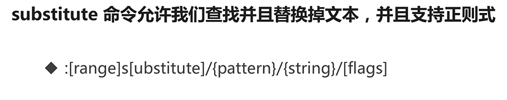
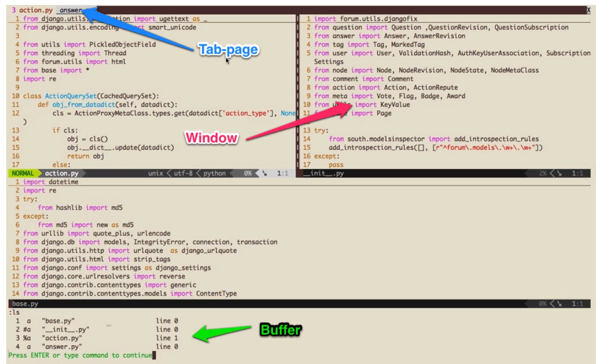
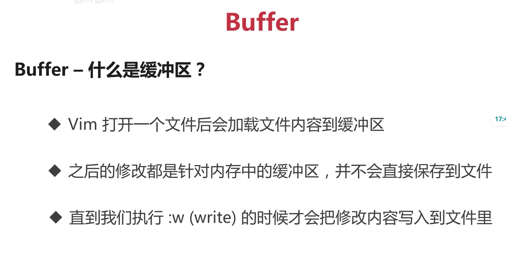
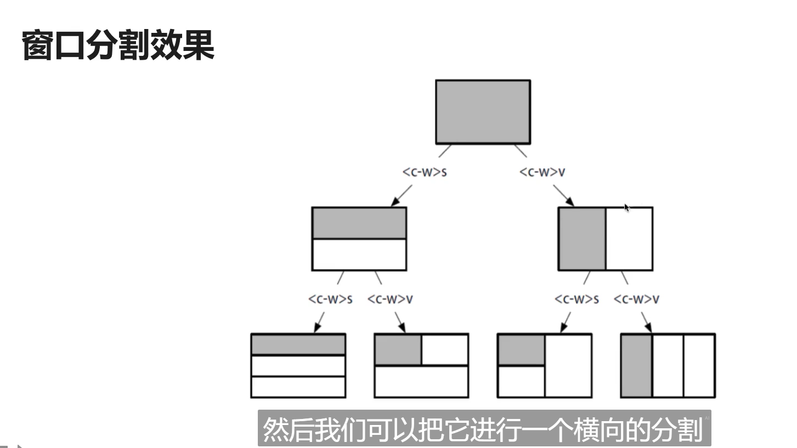
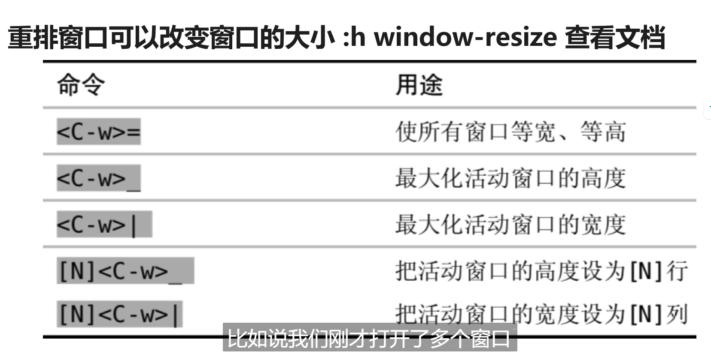
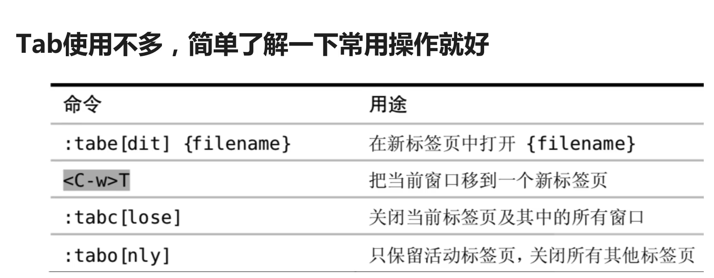
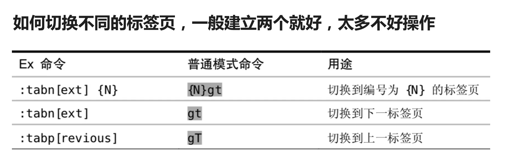
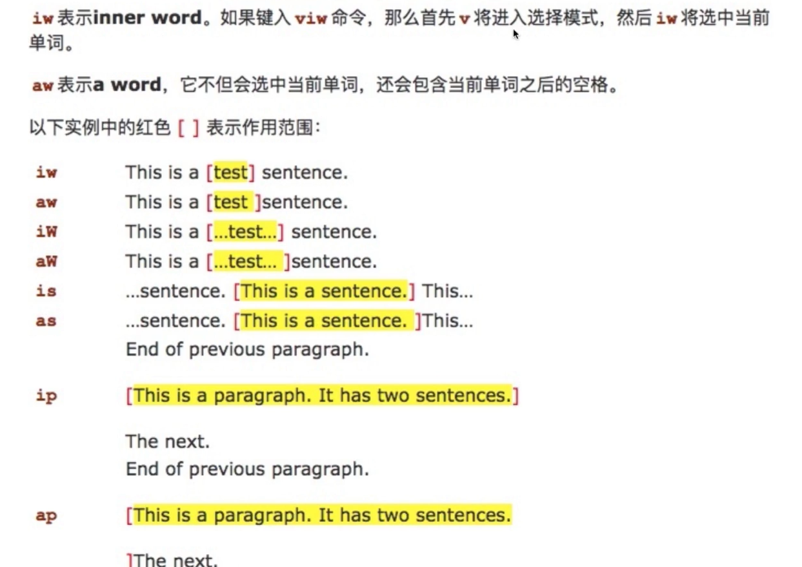

**跳转, 范围, 还有标注三个功能配合使用. **

## 移动相关
### 翻页命令
1、翻整页命令为： Ctrl + f 键 （f 的英文全拼为：forward） Ctrl + b 键 （b 的英文全拼为：backward)
2、翻半页命令为： Ctrl + d 键 （d 的英文全拼为：down） Ctrl + u 键 （u 的英文全拼为：up）
3、定位到页眉和页脚： 直接查看该脚本的第一行，请输入“:0”，然后回车即可。 直接查看该脚本的最后一行，请输入“:$”，然后回车即可。 备注：$ 常用于表示结尾的含义。

### 将当前行的内容向下移动
需要设置映射: 
```vimscript
nnoremap [e  :<c-u>execute 'move -1-'. v:count1<cr>
nnoremap ]e  :<c-u>execute 'move +'. v:count1<cr>
```

不过在 ideavim里面设置好像不生效...

# idea的actionlist
actionlist

# vim中关闭烦人的错误提示音效
在配置文件里面: 
```vimscript
" No annoying sound on errors
set noerrorbells
set novisualbell
set t_vb=
set tm=500
```

# 按键映射
不要在控制台里面随便胡乱映射, 配置文件本质是一堆的控制台指令直接执行;

# 寄存器的使用
使用双引号和寄存器的名称可以使用指定的寄存器.

# idea的 action
命令模式下输入 actionlist 可以查看命令的清单, 虽然我觉得没什么用就是了


# openvim的vim教程
f可以查找指定的字符（character）
例如3fo，就是找到往后第三个o对应的单词

括号，引号和双引号可以跳转到对应字符的位置

i也可以作为重复指令输入：比如重复你在i里面输入的三次内容：
3igo ESC
会输出gogogo


使用星号和井号可以向后和向前搜索当前光标所在的单词

斜杠提供的搜索功能可以使用那个转移符号使用特定的功能

大小写x分别可以向前和向后删除字符

使用 .号可以重复上次输入的命令

cmd下可以使用 :vs（vertical split） :sp（split） 进行水平和垂直分屏

下面这个命令可以进行一个全局替换，具体的含义没有完全搞清楚：
`:% s/java/python/r`

可视化模式的操作：
均在Normal模式下：
v进入可视化，默认一个字符一个字符选择；
V进入可视化，一次选择一行；
ctrl+v进入方块选择：可以进行一个长方形的选择；有时候可能会非常强大

Insert模式下的快捷键：（这是我以前从来没接触到的！）
Ctrl+h：删除上一个字符
Ctrl+w：删除到单词首
Ctrl+u：删除到当前行（好像不行，不过我可以换）

这些命令在Linux Shell的终端也是可以使用的！

顺便提一下在终端下常用的快捷键：
以上提到的三个；
Ctrl+a：移动到行首
Ctrl+e：移动到行尾
Ctrl+b：向左移动一个字符
Ctrl+f：右

除了esc，ctrl+[也可以切换到normal模式下

gi可以快速跳转你最后一次编辑的地方并进入插入模式

可以使用HKKB和Poker2这种迷你键盘

**如果你觉得vim自带的快捷键不好用，那就果断的修改它！**

W是分割以空白符分割的单词

在行间进行搜索移动：
f和t加一个字符可以快速在行间搜索和移动

在使用诸如diw和daw之类的命令的时候，i和a分别是指 inner和around的意思，
t表示until的意思；

Vim的删除命令：
d和x是主要的删除命令；

Vim修改：
Replace、Change、Substitute
r+char可以替换一个字符；
change和delete、yank用法一样
Sub会替换并进入插入模式

使用 斜杠和问号可以向前和向后搜索，
n和N表示向下查找和向上查找
星号和井号就是向前和向后查找当前单词。

Vim的替换命令


range表示范围，比如10, 20就表示 10到20行； %表示全部


例如使用 g表示可以全局替换；
使用 n可以统计单词出现的次数

```shell
: % s/self//n
```
上面这个就是统计整个代码文件中self出现了多少次

vim的模式串可以设置正则匹配，不过和主流的编程语言不太一样
有需要的时候再去记录；






命令ls可以查看当前存在的缓冲区。注意缓冲区就是vim**已经加载到内存中的文本**
通过命令行下的b可以跳转对应的buffer。
冒号e（editor）可以打开一个新文件（加入到缓冲区）

窗口window就是指可视的窗口，
窗口就是多个可视化的区域；


通过命令sp和vs可以进行分割
就是不知道为什么ctrl+w的快捷键会导致shell那个终端卡死
ideavim里面没问题，通过cw+hjkl就可以进行窗口的移动

ctrl+w配合大写的hjkl可以移动窗口的位置



接下来是标签（tab）的操作：
tab在其他ide或者浏览器一般是一个页面，但是在vim里面它代表多个窗口的组合；把它看成所谓的 workspace（**工作区**）可能更好。

了解一下tab的操作应该就行：



# 文本对象的操作方式
dw其实就是一种典型的操作文本对象的方式：
number command text object

常见的文本对象的话：
w：word
s：sentence
p：paragraph



还有实用的成对括号的内容：
配合i和a搭配对应的符号可以选中符号内部的内容
我挺喜欢这个的。


Vim用于自动补全的快捷键：
我是从这个博客里面知道的
[vim中自动补全的快捷键](https://blog.csdn.net/henpat/article/details/42077561)
使用ide的话，用cn和cp选择候选的补全项，这样就不用移动到方向键上了。

# Vim宏
可以将宏理解成命令集合；
可以通过q加寄存器的方式去录制宏；
使用@回放录制的宏

zz可以将光标所在行固定在屏幕中央
zt则在顶层

visual mode下可以通过`U/u`来对应转换大小写

# Vim配置文件
最重要的是两个：
1. 知道持久化配置
1. 知道怎么设置按键的映射

第一个可以在vim里面的命令模式下输入`h option-list`可以显示所有用set控制开启的命令（应该是）

第二个的话，主要是使用map和noremap的使用：
除了是自己定制vimscript，不然在任何时候都推荐你使用noremap来设置映射。

# 最有用的一章！使用Vim插件！
vim插件是使用vimscript(vim的一种脚本语言)编写的相关插件。
它为vim提供极高的扩展性。

想要安装插件的话，
原始一点的方式：可以通过fork代码的形式来安装
现代一点的话都是通过插件管理器来进行安装：这里推荐使用vim-plug

# 设置Linux云服务器可以访问github
题外话：在使用例如腾讯云之类的服务器的时候怎么访问github：
原理： 修改host来绕过国内傻逼的dns污染：
## 方法一：
具体操作请看：
[知乎](https://zhuanlan.zhihu.com/p/374584044)

## vim-plug插件的安装
在终端中通过链接 `curl -fLo ~/.vim/autoload/plug.vim --create-dirs https://raw.githubusercontent.com/junegunn/vim-plug/master/plug.vim`
即可（需要确保可以连接到github）

它的使用比较简单：类似Ruby的那种start和end的那种语法，把插件的指令加入到里面，退出的时候就会自动通过网络安装了：
比如：
安装第一个插件，通过实例文档，复制一下的代码到你的vimrc里面去：
```vimscript
call plug#begin()
把插件放在这里
call plug#end()
```


## 寻找插件
1. ​​​​​​​​​​​​谷歌，最容易想到的
1. ​​​​​​​​​​​​网址vimawesome
1. ​​​​​​​​​​​​使用别人的配置，从里面拿有用的东西

## 美化插件
vim-startify 美化启动页面
​​​​​​​​​​​vim-airline 美化状态栏
​​​​​​​​​​​identline 增加代码缩进线条

## 文件管理
如果不想通过**退出vim然后用vim打开另外一个文件**这种方式来进行多文件的编辑操作的时候，
通过插件nerdtree插件（它是最流行的文件树管理插件）

通过colorscheme指令可以切换配色方案。
推荐的配色方案：
vim-hybird
solarized
gruvbox

## 快速定位文本位置： easy-motion
ezmotion官方提供的文档比较长，其实只有两个常用的操作：
- 直接跳转的方式；
- 先搜索过滤， 然后再跳转（视频里面用的命令式递归的ss：“nmap ss ...”）

## 成双成对的编辑：vim-sourround
在有类似**把一对单引号改成一对双引号**的需求的时候，用vim的默认操作去修改是比较低效的。
vim-sourround插件可以高效操作。

wait updating...

视频本身很短，以后再考虑用 Plug的指令去安装这个插件，在原生的vim上。
# 自定义命令
通过命令command可以自定义命令：
`command custom_command system_command`
例如： command tuichu :q
推荐使用 com!的形式 来绑定；

# linux终端通过ssh进行github验证
用ssh密钥与github进行通信：
1. terminal 输入指令`ssh-keygen -t rsa -C “xxxxx@xxxxx.com”` 可以生成ssh公钥和私钥；
1. 通过cat命令，输出在home目录的 ~/.ssh/id_rsa.pub的内容；
1. 然后去git服务器添加公钥即可；
1. 可以用ssh -T git@gitee.com测试；