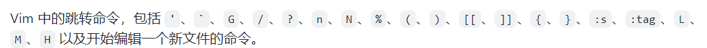

# 记录vim操作
gUw: w是选中当前的单词, U是转换大写的意思, g暂时不知道, gU组合的意思把**下一个选定的范围变成大写**
:bp和:bn 这是两个指令, 可以切换上一个标签和下一个标签, 虽然是指令, 但是应该可以通过**配置文件重新映射**
idea使用: 连续两次回车显示 上下文操作, 等于 alt + enter
shift + 6: 跳转到 行首**第一个非空格处**

配置文件里面尖括号里面CR就是 回车的意思, 用于绑定一些 指令. 这是个重要的知识.

## 关于跳转相关: 
jumps 指令可以查看历史记录**跳转指令**的100次历史, 很方便



快速跳转上义词跳转的位置使用 连续两个反引号或者引号.

**跳转, 范围, 还有标注三个功能配合使用. **

## 移动相关
### 翻页命令
1、翻整页命令为： Ctrl + f 键 （f 的英文全拼为：forward） Ctrl + b 键 （b 的英文全拼为：backward)
2、翻半页命令为： Ctrl + d 键 （d 的英文全拼为：down） Ctrl + u 键 （u 的英文全拼为：up）
3、定位到页眉和页脚： 直接查看该脚本的第一行，请输入“:0”，然后回车即可。 直接查看该脚本的最后一行，请输入“:$”，然后回车即可。 备注：$ 常用于表示结尾的含义。

### 将当前行的内容向下移动
需要设置映射: 
```vimscript
nnoremap [e  :<c-u>execute 'move -1-'. v:count1<cr>
nnoremap ]e  :<c-u>execute 'move +'. v:count1<cr>
```

不过在 ideavim里面设置好像不生效...

# idea的actionlist
actionlist

# vim中关闭烦人的错误提示音效
在配置文件里面: 
```vimscript
" No annoying sound on errors
set noerrorbells
set novisualbell
set t_vb=
set tm=500
```

# 按键映射
不要在控制台里面随便胡乱映射, 配置文件本质是一堆的控制台指令直接执行;

# 寄存器的使用
使用双引号和寄存器的名称可以使用指定的寄存器.

# idea的 action
